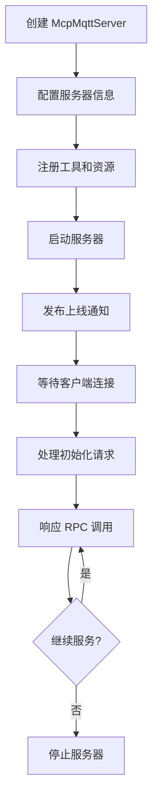
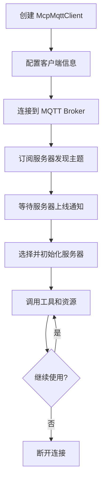

# MCP over MQTT TypeScript SDK 文档

## 📋 目录

1. [概述](#概述)
2. [修复前后对比](#修复前后对比)
3. [架构设计](#架构设计)
4. [快速开始](#快速开始)
5. [完整使用流程](#完整使用流程)
6. [API 参考](#api-参考)
7. [规范合规性](#规范合规性)
8. [最佳实践](#最佳实践)
9. [故障排除](#故障排除)

---

## 概述

MCP over MQTT TypeScript SDK 是一个完全符合 [MCP over MQTT 规范](https://spec.modelcontextprotocol.io/specification/transport/mqtt/) 的 TypeScript 实现，支持浏览器和 Node.js 环境。

### 🎯 主要特性

- ✅ **完全规范合规** - 100% 符合 MCP over MQTT 官方规范
- 🌐 **跨环境支持** - 支持 Node.js (TCP) 和浏览器 (WebSocket)
- 🔒 **类型安全** - 完整的 TypeScript 类型定义
- 🚀 **自动发现** - 服务器自动发现和连接管理
- ⚡ **事件驱动** - 基于 EventEmitter 的响应式架构
- 🛡️ **错误处理** - 完善的错误处理和超时机制

---

## 修复前后对比

### 🔍 修复前的问题

我们的 SDK 在修复前存在以下关键问题，导致无法正常使用：

| 问题 | 影响 | 规范要求 |
|------|------|----------|
| **初始化流程 clientId 提取错误** | 服务器无法识别客户端 | 必须从 MQTT 用户属性获取 |
| **MQTT 5.0 用户属性缺失** | 消息无法正确路由 | 所有 PUBLISH 消息必须包含 |
| **服务器订阅时机错误** | 消息丢失或重复处理 | 应在初始化后动态订阅 |
| **Broker 建议处理缺失** | 无法利用 Broker 优化 | 必须处理 CONNACK 属性 |
| **超时配置不当** | 连接超时或响应慢 | 不同请求需要不同超时时间 |

### 🔧 修复后的改进

#### 1. **初始化流程修复**

**修复前（❌ 错误）**:
```typescript
// 无法从控制主题获取客户端ID
if (topic === this.topics.control) {
  await this.handleControlMessage(message, undefined) // clientId 为 undefined
}
```

**修复后（✅ 正确）**:
```typescript
// 从MQTT用户属性正确提取客户端ID
if (topic === this.topics.control) {
  const userProperties = packet?.properties?.userProperties || {}
  clientId = userProperties['MCP-MQTT-CLIENT-ID']
  await this.handleControlMessage(message, clientId)
}
```

#### 2. **MQTT 5.0 用户属性完整性**

**修复前（❌ 错误）**:
```typescript
// 服务器断连时缺少必需的用户属性
await this.mqttAdapter.publish(this.topics.presence, '', { retain: true })
```

**修复后（✅ 正确）**:
```typescript
// 所有PUBLISH消息都包含必需属性
await this.mqttAdapter.publish(this.topics.presence, '', {
  retain: true,
  userProperties: {
    'MCP-COMPONENT-TYPE': 'mcp-server',
    'MCP-MQTT-CLIENT-ID': this.config.identifiers.serverId,
  },
})
```

#### 3. **服务器订阅时机修复**

**修复前（❌ 错误）**:
```typescript
// 启动时预订阅所有客户端（不符合规范）
await this.mqttAdapter.subscribe(`$mcp-client/capability/+`)
await this.mqttAdapter.subscribe(`$mcp-client/presence/+`)
```

**修复后（✅ 正确）**:
```typescript
// 初始化时为特定客户端动态订阅
await this.mqttAdapter.subscribe(`$mcp-client/capability/${clientId}`)
await this.mqttAdapter.subscribe(`$mcp-client/presence/${clientId}`)
```

#### 4. **Broker 建议处理实现**

**修复前（❌ 缺失）**:
```typescript
// 只有注释，没有实际实现
// TODO: 实现 Broker 建议处理
```

**修复后（✅ 完整实现）**:
```typescript
private handleBrokerSuggestions(): void {
  const connackProperties = this.mqttAdapter.getConnackProperties()
  if (connackProperties?.userProperties) {
    // 处理 MCP-SERVER-NAME-FILTERS
    const mcpServerNameFilters = connackProperties.userProperties['MCP-SERVER-NAME-FILTERS']
    if (mcpServerNameFilters) {
      const filters = JSON.parse(mcpServerNameFilters)
      this.serverNameFilter = filters[0]
    }

    // 处理 MCP-RBAC
    const mcpRbac = connackProperties.userProperties['MCP-RBAC']
    if (mcpRbac) {
      this.emit('brokerRbacInfo', JSON.parse(mcpRbac))
    }
  }
}
```

#### 5. **分级超时配置**

**修复前（❌ 不准确）**:
```typescript
// 所有请求都使用30秒超时
setTimeout(() => {
  reject(new Error(`Request timeout: ${request.method}`))
}, 30000)
```

**修复后（✅ 符合规范）**:
```typescript
private getRequestTimeout(method: string): number {
  const timeouts: Record<string, number> = {
    'initialize': 30000,
    'ping': 10000,
    'tools/call': 60000,
    'sampling/createMessage': 60000,
    // ... 符合规范的所有超时时间
  }
  return timeouts[method] || 30000
}
```

---

## 架构设计

### 🏗️ 核心组件

```
┌─────────────────────────────────────────────────────────┐
│                    MCP over MQTT SDK                    │
├─────────────────────────────────────────────────────────┤
│  📦 McpMqttServer    │  📦 McpMqttClient                │
│  - 工具注册          │  - 服务器发现                     │
│  - 资源管理          │  - 自动连接                       │
│  - 请求处理          │  - API 调用                       │
├─────────────────────────────────────────────────────────┤
│              📡 UniversalMqttAdapter                    │
│              - 环境自适应 (Node.js/Browser)              │
│              - MQTT 5.0 支持                            │
│              - CONNACK 属性处理                          │
├─────────────────────────────────────────────────────────┤
│  🌐 Node.js (TCP)    │  🌐 Browser (WebSocket)          │
│  - mqtt.connect      │  - WebSocket 连接                 │
│  - 默认端口: 1883     │  - 默认端口: 8084                 │
└─────────────────────────────────────────────────────────┘
```

### 📋 MQTT 主题架构

```
MCP over MQTT 主题结构:

🗂️ 服务器相关主题:
├── $mcp-server/{server-id}/{server-name}              # 控制主题
├── $mcp-server/capability/{server-id}/{server-name}   # 能力变更
└── $mcp-server/presence/{server-id}/{server-name}     # 服务器状态

🗂️ 客户端相关主题:
├── $mcp-client/capability/{mcp-client-id}             # 客户端能力变更
└── $mcp-client/presence/{mcp-client-id}               # 客户端状态

🗂️ RPC 通信:
└── $mcp-rpc/{mcp-client-id}/{server-id}/{server-name} # 双向通信
```

---

## 快速开始

### 📦 安装

```bash
npm install @emqx-ai/mcp-mqtt-sdk
```

### 🚀 基本用法

#### 创建服务器

```typescript
import { McpMqttServer } from '@emqx-ai/mcp-mqtt-sdk'

const server = new McpMqttServer({
  mqtt: {
    host: 'localhost',
    port: 1883,
  },
  serverInfo: {
    name: 'My MCP Server',
    version: '1.0.0',
  },
  identifiers: {
    serverId: 'mcp-server-123',
    serverName: 'my-app/server',
  },
  description: 'A sample MCP server',
  capabilities: {
    tools: { listChanged: true },
    resources: { listChanged: true, subscribe: false },
  },
})

// 注册工具
server.tool('echo', 'Echo back the input', {
  type: 'object',
  properties: {
    message: { type: 'string', description: 'Message to echo' }
  },
  required: ['message']
}, async ({ message }) => ({
  content: [{ type: 'text', text: `Echo: ${message}` }]
}))

// 启动服务器
await server.start()
```

#### 创建客户端

```typescript
import { McpMqttClient } from '@emqx-ai/mcp-mqtt-sdk'

const client = new McpMqttClient({
  mqtt: {
    host: 'localhost',
    port: 1883,
  },
  clientInfo: {
    name: 'My MCP Client',
    version: '1.0.0',
  },
  capabilities: {
    roots: { listChanged: false },
    sampling: {},
  },
})

// 监听服务器发现
client.on('serverDiscovered', async (server) => {
  console.log(`发现服务器: ${server.name}`)

  // 初始化连接
  await client.initializeServer(server.serverId)

  // 调用工具
  const result = await client.callTool(server.serverId, 'echo', {
    message: 'Hello, MCP!'
  })
  console.log(result.content[0].text) // "Echo: Hello, MCP!"
})

// 连接并开始发现
await client.connect()
```

---

## 完整使用流程

### 🔄 服务器端流程



#### 1. 服务器配置

```typescript
interface McpMqttServerConfig {
  mqtt: {
    host: string                    // MQTT Broker 地址
    port?: number                   // 端口 (默认: 1883)
    clientId?: string               // 客户端ID (自动生成)
    username?: string               // 用户名
    password?: string               // 密码
    tls?: boolean                   // 是否使用TLS
  }
  serverInfo: {
    name: string                    // 服务器名称
    version: string                 // 版本号
  }
  identifiers: {
    serverId: string                // 唯一服务器ID
    serverName: string              // 分层服务器名称 (如: "app/feature/server")
  }
  description: string               // 服务器描述
  capabilities: {
    tools?: { listChanged?: boolean }
    resources?: { listChanged?: boolean, subscribe?: boolean }
    prompts?: { listChanged?: boolean }
  }
  rbac?: {                         // 可选的角色访问控制
    roles: Array<{
      name: string
      description: string
      allowed_methods: string[]
      allowed_tools: string[] | "all"
      allowed_resources: string[] | "all"
    }>
  }
}
```

#### 2. 工具注册

```typescript
// 简单工具
server.tool('getCurrentTime', 'Get current timestamp', {
  type: 'object',
  properties: {}
}, async () => ({
  content: [{
    type: 'text',
    text: new Date().toISOString()
  }]
}))

// 复杂工具
server.tool('fileOperation', 'File operations', {
  type: 'object',
  properties: {
    operation: {
      type: 'string',
      enum: ['read', 'write', 'delete'],
      description: 'Operation type'
    },
    path: {
      type: 'string',
      description: 'File path'
    },
    content: {
      type: 'string',
      description: 'Content for write operation'
    }
  },
  required: ['operation', 'path']
}, async ({ operation, path, content }) => {
  try {
    switch (operation) {
      case 'read':
        // 读取文件逻辑
        return { content: [{ type: 'text', text: 'File content...' }] }
      case 'write':
        // 写入文件逻辑
        return { content: [{ type: 'text', text: 'File written successfully' }] }
      case 'delete':
        // 删除文件逻辑
        return { content: [{ type: 'text', text: 'File deleted successfully' }] }
      default:
        throw new Error('Invalid operation')
    }
  } catch (error) {
    return {
      content: [{ type: 'text', text: `Error: ${error.message}` }],
      isError: true
    }
  }
})
```

#### 3. 资源管理

```typescript
// 静态资源
server.resource(
  'config:main',
  'Application Configuration',
  async () => ({
    contents: [{
      uri: 'config:main',
      mimeType: 'application/json',
      text: JSON.stringify({
        version: '1.0.0',
        features: ['tool1', 'tool2']
      })
    }]
  }),
  {
    description: 'Main application configuration',
    mimeType: 'application/json'
  }
)

// 动态资源
server.resource(
  'status:current',
  'Current System Status',
  async () => ({
    contents: [{
      uri: 'status:current',
      mimeType: 'application/json',
      text: JSON.stringify({
        timestamp: new Date().toISOString(),
        uptime: process.uptime(),
        memory: process.memoryUsage()
      })
    }]
  })
)
```

### 🔄 客户端流程



#### 1. 客户端配置

```typescript
interface McpMqttClientConfig {
  mqtt: {
    host: string
    port?: number
    clientId?: string               // 每次初始化请求必须使用不同ID
    username?: string
    password?: string
    tls?: boolean
  }
  clientInfo: {
    name: string
    version: string
  }
  capabilities: {
    roots?: { listChanged?: boolean }
    sampling?: Record<string, any>
  }
}
```

#### 2. 服务器发现和连接

```typescript
const client = new McpMqttClient(config)

// 监听服务器发现
client.on('serverDiscovered', async (server) => {
  console.log(`发现服务器: ${server.name}`)
  console.log(`- 服务器ID: ${server.serverId}`)
  console.log(`- 描述: ${server.description}`)

  // 可以根据服务器信息决定是否连接
  if (server.name.includes('MyApp')) {
    try {
      const serverInfo = await client.initializeServer(server.serverId)
      console.log(`成功连接到: ${serverInfo.name}`)
    } catch (error) {
      console.error(`连接失败: ${error.message}`)
    }
  }
})

// 监听服务器断连
client.on('serverDisconnected', (serverId) => {
  console.log(`服务器断连: ${serverId}`)
})

// 监听 Broker RBAC 信息
client.on('brokerRbacInfo', (rbacInfo) => {
  console.log('收到 Broker RBAC 信息:', rbacInfo)
})

await client.connect()
```

#### 3. API 调用

```typescript
// 列出可用工具
const tools = await client.listTools(serverId)
console.log('可用工具:', tools.map(t => t.name))

// 调用工具
const result = await client.callTool(serverId, 'getCurrentTime', {})
console.log('当前时间:', result.content[0].text)

// 列出资源
const resources = await client.listResources(serverId)
console.log('可用资源:', resources.map(r => r.uri))

// 读取资源
const configData = await client.readResource(serverId, 'config:main')
const config = JSON.parse(configData.contents[0].text)

// 健康检查
const isHealthy = await client.ping(serverId)
console.log('服务器健康状态:', isHealthy)
```

---

## API 参考

### 🔧 McpMqttServer

#### 构造函数
```typescript
constructor(config: McpMqttServerConfig)
```

#### 主要方法

| 方法 | 描述 | 参数 | 返回值 |
|------|------|------|-------|
| `start()` | 启动服务器 | 无 | `Promise<void>` |
| `stop()` | 停止服务器 | 无 | `Promise<void>` |
| `tool()` | 注册工具 | `name, description, schema, handler` | `void` |
| `resource()` | 注册资源 | `uri, name, handler, options?` | `void` |
| `getTopics()` | 获取主题信息 | 无 | `TopicInfo` |
| `getConnectedClients()` | 获取已连接客户端 | 无 | `string[]` |

#### 事件

| 事件 | 描述 | 参数 |
|------|------|------|
| `ready` | 服务器启动完成 | 无 |
| `error` | 发生错误 | `Error` |
| `closed` | 服务器已关闭 | 无 |

### 📱 McpMqttClient

#### 构造函数
```typescript
constructor(config: McpMqttClientConfig)
```

#### 主要方法

| 方法 | 描述 | 参数 | 返回值 |
|------|------|------|-------|
| `connect()` | 连接到 Broker | 无 | `Promise<void>` |
| `disconnect()` | 断开连接 | 无 | `Promise<void>` |
| `initializeServer()` | 初始化服务器连接 | `serverId: string` | `Promise<ServerInfo>` |
| `listTools()` | 列出工具 | `serverId: string` | `Promise<Tool[]>` |
| `callTool()` | 调用工具 | `serverId, name, args?` | `Promise<any>` |
| `listResources()` | 列出资源 | `serverId: string` | `Promise<Resource[]>` |
| `readResource()` | 读取资源 | `serverId, uri` | `Promise<any>` |
| `ping()` | 健康检查 | `serverId: string` | `Promise<boolean>` |
| `getDiscoveredServers()` | 获取已发现的服务器 | 无 | `ServerInfo[]` |
| `getConnectedServers()` | 获取已连接的服务器 | 无 | `ServerInfo[]` |
| `isServerConnected()` | 检查服务器连接状态 | `serverId: string` | `boolean` |

#### 事件

| 事件 | 描述 | 参数 |
|------|------|------|
| `connected` | 客户端已连接 | 无 |
| `disconnected` | 客户端已断连 | 无 |
| `serverDiscovered` | 发现新服务器 | `ServerInfo` |
| `serverInitialized` | 服务器初始化完成 | `ServerInfo` |
| `serverDisconnected` | 服务器断连 | `serverId: string` |
| `serverCapabilityChanged` | 服务器能力变更 | `serverId, method` |
| `brokerRbacInfo` | 收到 Broker RBAC 信息 | `rbacInfo` |
| `error` | 发生错误 | `Error` |

---

## 规范合规性

### ✅ 完全符合 MCP over MQTT 规范

我们的 SDK 严格按照 [MCP over MQTT 规范 v2024-11-05](https://spec.modelcontextprotocol.io/specification/transport/mqtt/) 实现：

#### 🔐 MQTT 要求
- ✅ **MQTT 5.0** - 强制使用 MQTT 协议版本 5.0
- ✅ **会话管理** - Session Expiry Interval 设置为 0
- ✅ **用户属性** - 所有消息包含必需的用户属性
- ✅ **No Local** - RPC 主题正确设置避免自消息

#### 📋 主题架构
- ✅ **控制主题** - `$mcp-server/{server-id}/{server-name}`
- ✅ **能力主题** - `$mcp-server/capability/{server-id}/{server-name}`
- ✅ **状态主题** - `$mcp-server/presence/{server-id}/{server-name}`
- ✅ **RPC 主题** - `$mcp-rpc/{mcp-client-id}/{server-id}/{server-name}`

#### 🔄 生命周期
- ✅ **服务发现** - 自动服务注册和发现
- ✅ **初始化流程** - 正确的三步握手
- ✅ **能力变更** - 动态能力列表更新
- ✅ **优雅断连** - 正确的断连通知

#### ⏱️ 超时配置
- ✅ **分级超时** - 不同请求类型使用规范建议的超时时间
- ✅ **可配置** - 支持自定义超时时间

#### 🛡️ 错误处理
- ✅ **协议版本** - 版本不匹配检测
- ✅ **能力协商** - 能力协商失败处理
- ✅ **超时检测** - 请求超时自动处理

---

## 最佳实践

### 🎯 服务器开发

#### 1. 工具设计原则
```typescript
// ✅ 好的实践：原子性工具
server.tool('getFileContent', 'Read file content', schema, async ({ path }) => {
  // 单一职责，清晰的输入输出
})

// ❌ 避免：复杂的多功能工具
server.tool('fileManager', 'File operations', schema, async (params) => {
  // 功能过于复杂，难以维护
})
```

#### 2. 错误处理
```typescript
server.tool('riskyOperation', 'Potentially failing operation', schema, async (params) => {
  try {
    const result = await someRiskyOperation(params)
    return { content: [{ type: 'text', text: JSON.stringify(result) }] }
  } catch (error) {
    return {
      content: [{ type: 'text', text: `操作失败: ${error.message}` }],
      isError: true  // 标记为错误
    }
  }
})
```

#### 3. 资源管理
```typescript
// 对于经常变化的资源，启用 listChanged
const serverConfig = {
  capabilities: {
    resources: {
      listChanged: true,  // 当资源列表变化时通知客户端
      subscribe: false    // 根据需要启用资源订阅
    }
  }
}

// 当资源列表变化时，自动通知会被发送
server.resource('new:resource', 'New Resource', handler)
```

#### 4. 服务器命名
```typescript
// ✅ 推荐：使用分层命名
{
  identifiers: {
    serverId: 'unique-server-id-123',
    serverName: 'company/product/feature'  // 便于客户端过滤
  }
}

// ❌ 避免：平坦命名
{
  identifiers: {
    serverName: 'myserver'  // 难以分类和过滤
  }
}
```

### 🎯 客户端开发

#### 1. 服务器选择策略
```typescript
client.on('serverDiscovered', async (server) => {
  // 根据服务器名称过滤
  if (server.serverName.startsWith('myapp/')) {
    // 根据描述选择
    if (server.description.includes('production')) {
      await client.initializeServer(server.serverId)
    }
  }
})
```

#### 2. 错误处理
```typescript
try {
  const result = await client.callTool(serverId, 'tool', params)
  if (result.isError) {
    console.error('工具执行失败:', result.content[0].text)
  } else {
    console.log('执行成功:', result.content[0].text)
  }
} catch (error) {
  console.error('调用失败:', error.message)
}
```

#### 3. 连接管理
```typescript
// 监听连接状态
client.on('serverDisconnected', (serverId) => {
  // 实现重连逻辑或降级处理
  console.log(`服务器 ${serverId} 断连，切换到备用服务器`)
})

// 定期健康检查
setInterval(async () => {
  for (const server of client.getConnectedServers()) {
    try {
      await client.ping(server.serverId)
    } catch (error) {
      console.warn(`服务器 ${server.serverId} 健康检查失败`)
    }
  }
}, 30000)
```

#### 4. 资源缓存
```typescript
class ResourceCache {
  private cache = new Map()

  async getResource(client: McpMqttClient, serverId: string, uri: string) {
    if (this.cache.has(uri)) {
      return this.cache.get(uri)
    }

    const resource = await client.readResource(serverId, uri)
    this.cache.set(uri, resource)
    return resource
  }

  // 监听资源更新
  onResourceUpdate(uri: string) {
    this.cache.delete(uri)  // 清除缓存
  }
}
```

### 🔒 安全最佳实践

#### 1. 认证配置
```typescript
const config = {
  mqtt: {
    host: 'secure-broker.example.com',
    port: 8883,
    tls: true,
    username: process.env.MQTT_USERNAME,
    password: process.env.MQTT_PASSWORD,
  }
}
```

#### 2. 输入验证
```typescript
server.tool('fileRead', 'Read file', {
  type: 'object',
  properties: {
    path: {
      type: 'string',
      pattern: '^[a-zA-Z0-9/_.-]+$'  // 限制路径格式
    }
  }
}, async ({ path }) => {
  // 额外的安全检查
  if (path.includes('..') || path.startsWith('/etc/')) {
    throw new Error('拒绝访问敏感路径')
  }
  // 继续处理...
})
```

#### 3. RBAC 配置
```typescript
const serverConfig = {
  rbac: {
    roles: [
      {
        name: 'readonly',
        description: '只读权限',
        allowed_methods: ['tools/list', 'resources/list', 'resources/read'],
        allowed_tools: ['read*'],  // 只允许读取类工具
        allowed_resources: ['public/*']  // 只允许访问公共资源
      },
      {
        name: 'admin',
        description: '管理员权限',
        allowed_methods: 'all',
        allowed_tools: 'all',
        allowed_resources: 'all'
      }
    ]
  }
}
```

---

## 故障排除

### 🔍 常见问题

#### 1. 连接问题

**问题**: 客户端无法发现服务器
```bash
错误: 等待30秒后未发现任何服务器
```

**解决方案**:
```typescript
// 检查网络连接
const client = new McpMqttClient({
  mqtt: {
    host: 'localhost',  // 确认 Broker 地址正确
    port: 1883,         // 确认端口正确
  }
})

// 添加详细日志
client.on('error', (error) => {
  console.error('客户端错误:', error)
})

// 检查服务器是否正确启动
server.on('ready', () => {
  console.log('服务器已启动，主题:', server.getTopics())
})
```

#### 2. 初始化失败

**问题**: 初始化请求超时
```bash
错误: Request timeout: initialize (30000ms)
```

**解决方案**:
```typescript
// 检查 MQTT 用户属性
const client = new McpMqttClient({
  mqtt: {
    // 确保 clientId 被正确设置
    clientId: 'unique-client-id-' + Date.now()
  }
})

// 检查服务器端处理逻辑
server.on('error', (error) => {
  console.error('服务器错误:', error)
})
```

#### 3. 工具调用失败

**问题**: 工具未找到
```bash
错误: Tool not found: myTool
```

**解决方案**:
```typescript
// 确认工具已正确注册
server.tool('myTool', 'My Tool', schema, handler)

// 列出所有注册的工具
const tools = await client.listTools(serverId)
console.log('可用工具:', tools.map(t => t.name))

// 检查工具名称是否匹配
await client.callTool(serverId, 'myTool', params)  // 确保名称一致
```

#### 4. 权限问题

**问题**: 访问被拒绝
```bash
错误: Access denied for tool: sensitiveOperation
```

**解决方案**:
```typescript
// 检查 RBAC 配置
client.on('brokerRbacInfo', (rbacInfo) => {
  console.log('用户权限:', rbacInfo)
})

// 调整服务器 RBAC 设置
const serverConfig = {
  rbac: {
    roles: [{
      name: 'user',
      allowed_tools: ['sensitiveOperation']  // 添加权限
    }]
  }
}
```

### 🛠️ 调试技巧

#### 1. 启用详细日志
```typescript
// 服务器端
server.on('ready', () => console.log('✅ 服务器启动'))
server.on('error', (err) => console.error('❌ 服务器错误:', err))

// 客户端
client.on('connected', () => console.log('✅ 客户端连接'))
client.on('serverDiscovered', (s) => console.log('🔍 发现服务器:', s.name))
client.on('error', (err) => console.error('❌ 客户端错误:', err))
```

#### 2. 网络诊断
```bash
# 检查 MQTT Broker 连接
mosquitto_pub -h localhost -p 1883 -t test -m "hello"

# 监控 MQTT 消息
mosquitto_sub -h localhost -p 1883 -t '$mcp-server/+/+' -v

# 检查端口占用
netstat -tulpn | grep 1883
```

#### 3. 消息追踪
```typescript
// 在 MQTT 适配器中添加消息追踪
this.client.on('message', (topic, payload) => {
  console.log(`📨 收到消息 [${topic}]:`, payload.toString())
})

this.client.on('publish', (packet) => {
  console.log(`📤 发送消息 [${packet.topic}]:`, packet.payload?.toString())
})
```

### 📊 性能优化

#### 1. 连接池管理
```typescript
class McpClientPool {
  private clients = new Map()

  async getClient(brokerId: string) {
    if (!this.clients.has(brokerId)) {
      const client = new McpMqttClient(this.getConfig(brokerId))
      await client.connect()
      this.clients.set(brokerId, client)
    }
    return this.clients.get(brokerId)
  }
}
```

#### 2. 消息批处理
```typescript
class BatchProcessor {
  private batch = []

  async addMessage(message) {
    this.batch.push(message)
    if (this.batch.length >= 10) {
      await this.processBatch()
    }
  }

  private async processBatch() {
    // 批量处理消息
    await Promise.all(this.batch.map(msg => this.processMessage(msg)))
    this.batch = []
  }
}
```

#### 3. 资源缓存策略
```typescript
class SmartCache {
  private cache = new LRU({ max: 1000, ttl: 300000 })  // 5分钟TTL

  async get(key: string, fetcher: () => Promise<any>) {
    if (this.cache.has(key)) {
      return this.cache.get(key)
    }

    const value = await fetcher()
    this.cache.set(key, value)
    return value
  }
}
```

---

## 总结

<function_calls>
<invoke name="TodoWrite">
<parameter name="todos">[{"content": "\u5199MCP over MQTT SDK\u6587\u6863", "status": "completed", "activeForm": "\u5199MCP over MQTT SDK\u6587\u6863"}, {"content": "\u5305\u542b\u4fee\u590d\u524d\u540e\u5bf9\u6bd4", "status": "completed", "activeForm": "\u5305\u542b\u4fee\u590d\u524d\u540e\u5bf9\u6bd4"}, {"content": "\u5305\u542b\u5b8c\u6574\u4f7f\u7528\u6d41\u7a0b", "status": "completed", "activeForm": "\u5305\u542b\u5b8c\u6574\u4f7f\u7528\u6d41\u7a0b"}]
